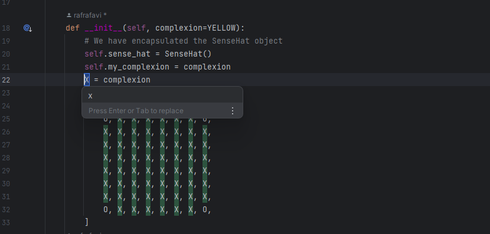

# Evidence and Knowledge

This document includes instructions and knowledge questions that must be completed to receive a *Competent* grade on this portfolio task.

## 1. Required evidence

### 1.1. Answer all questions in this document

- Each answer should be complete, well-articulated, and within the specified word count limits (if added) for each question.
- Please make sure **all** external sources are properly cited.
- You must **use your own words**. Please include your full chat transcripts if you use generative AI in any way.
- Generative AI hallucinates, is not an authoritative source

### 1.2. Make all the required modifications to the code

- Please follow the instructions in this document to make the changes needed to the code.

- When requested to upload evidence, upload all screenshots to `screenshots/` and embed them in this document. For example:

```markdown

```


> Note the `!`, and the use of a relative path.

- You must upload the code into your GitHub repository.
- While you can use a branch, your code should be in main when you submit.
- Upload a zip of this repository to Blackboard when you are ready to submit.
- You will be notified of your result via Blackboard
- However, if using GitHub classrooms, you may also receive additional feedback on GitHub directly

### 1.3. Optional: Use of Raspberry Pi and SenseHat

Raspberry Pi or SenseHat is **optional** for this activity. You can use the included `sense_hat.py` file to simulate the SenseHat on your computer.

If you use a Pi, please **delete** the `sense_hat.py` file.

### 1.4. Accessible version of the code

This project relies on visual patterns that appear on an LED matrix. If you have any accessibility requirements, you can use the `udl/accessible` branch to complete the project. This branch provides an accessible code version that uses text-based patterns instead of visual ones.

Please discuss this with your lecturer before using that branch.

## 2. Specific Tasks & Questions

Address the following tasks and questions based on the code provided in this repository.

### 2.1. Set up the project locally

1. Fork this repository (if not using GitHub Classrooms)
2. Clone your repository locally
3. Run the project locally by executing the `main.py` file
4. Evidence this by providing screenshots of the project directory structure and the output of the `main.py` file


If you are running on a Raspberry Pi, you can use the following command to run the project and then screenshot the result:

```bash
ls
python3 main.py
```

### 2.2. Fundamental code comprehension

 Answer each of the following questions **as they relate to that code** supplied by in this repository (ignore `sense_hat.py`):

1. Examine the code for the `smiley.py` file and provide  an example of a variable of each of the following types and their corresponding values (`_` should be replaced with the appropriate values):

   | Type                    | name   | value         |
   | ----------              |--------|---------------|
   | built-in primitive type | dimmed | True          |
   | built-in composite type | WHITE  | (255,255,255) |
   | user-defined type       | Smiley | Smiley()      |

2. Fill in (`_`) the following table based on the code in `smiley.py`:

   | Object                   | Type               |
   | ------------             |--------------------|
   | self.pixels              | Built-in composite |
   | A member of self.pixels  | Built-in composite |
   | self                     | User-defined type  |

3. Examine the code for `smiley.py`, `sad.py`, and `happy.py`. Give an example of each of the following control structures using an example from **each** of these files. Include the first line and the line range:

   | Control Flow | File      | First line                    | Line range |
   | ------------ |-----------|-------------------------------|------------|
   |  sequence    | smiley.py | class Smiley: (Line 4)        | 4 - 39     |
   |  selection   | sad.py    | if wide_open: (Line 26)       | 26 - 30    |
   |  iteration   | happy.py  | for pixel in mouth: (Line 21) | 21 -22     |

4. Though everything in Python is an object, it is sometimes said to have four "primitive" types. Examining the three files `smiley.py`, `sad.py`, and `happy.py`, identify which of the following types are used in any of these files, and give an example of each (use an example from the code, if applicable, otherwise provide an example of your own):

   | Type                    | Used?           | Example                                                                                              |
   | ----------------------- |-----------------|------------------------------------------------------------------------------------------------------|
   | int                     | Yes - smiley.py | Line 6 - GREEN = (0, 255, 0). The value for GREEN is a tuple, but it's elements are integers.        |
   | float                   | Yes - happy.py  | Line 33 - def blink(self, **_delay=0.25_**):. delay is a float.                                      |
   | str                     | No              | There are no examples of an str type within the code. An example of a str could be emotion = "angry" |
   | bool                    | Yes -   sad.py  | Line 19 - def draw_eyes(self, **_wide_open=True_**): . In this example, the wide_open object is a bool|

5. Examining `smiley.py`, provide an example of a class variable and an instance variable (attribute). Explain **why** one is defined as a class variable and the other as an instance variable.

> Class variable: The variables WHITE, GREEN, RED, YELLOW and BLANK are all examples of class variables. They are defined within the class,
> but outside any methods. All instances of the Smiley() class will share these variables.
> 
> Instance variable: self.pixels (Line 17). Each instance of Smiley() will have its own mutable instance of self.pixels - this is neccesary to allow 
> for modification of the grid. 
>

6. Examine `happy.py`, and identify the constructor (initializer) for the `Happy` class:
   1. What is the purpose of a constructor (in general) and this one (in particular)?

   >The constructor is located on line 10, using def __init__(self): . Constructors are used to define instance variables, and establish the 
   > initial state of the object. In the Happy class specifically, the constructor is used to create the happy expression, first by calling the Smiley superclass using
   > super().
   > 

   2. What statement(s) does it execute (consider the `super` call), and what is the result?

   > The constructor inherits the attributes of the parent class, using super(). In doing this, it executes the configuration of the parent class,
   > and then modifies it using the draw_mouth and draw_eyes methods.
   >

### 2.3. Code style

1. What code style is used in the code? Is it likely to be the same as the code style used in the SenseHat? Give to reasons as to why/why not:

> The code adheres to the PEP 8 standard. The code also encapsulates the SenseHat object (in smiley.py), which is required for the code to function as intended. Because of this, for the sake of readability and functionality,
> the SenseHat is likely to follow the same style, with minor deviations to accommodate the functions of the SenseHat's hardware. 
> 
>

2. List three aspects of this convention you see applied in the code.

> 1. snake_case is used for defining variables and functions: for example, line 16 of happy.py (def draw_mouth(self))
> 2. CamelCase is used when naming classes: for example, line 6 of happy.py (class Happy(Smiley, Blinkable))
> 3. Docstrings are written with triple quotes: for example, lines 20 to 23 of sad.py.
>

3. Give two examples of organizational documentation in the code.

> 1. Docstrings - seen in lines 7 - 9 in happy.py
> 2. Inline comments - seen on line 12 of smiley.py
>

### 2.4. Identifying and understanding classes

> Note: Ignore the `sense_hat.py` file when answering the questions below

1. List all the classes you identified in the project. Indicate which classes are base classes and which are subclasses. For subclasses, identify all direct base classes.
  
  Use the following table for your answers:

| Class Name | Super or Sub? | Direct parent(s)  |
|------------|---------------|-------------------|
| Smiley     | Super         |                   |
| Blinkable  | Super         |                   |
| Happy      | Sub           | Smiley, Blinkable |
| Sad        | Sub           | Smiley            |

2. Explain the concept of abstraction, giving an example from the project (note "implementing an ABC" is **not** in itself an example of abstraction). (Max 150 words)

> Abstraction is the process of hiding irrelevant details from a user,only displaying to the user the most essential
> and functionally relevant code. This can be seen in the Smiley class, where the SenseHat object is encapsulated.
> The user does not see the workings of the SenseHat object, only that they can call the methods show() or dim_display() 
> to use it.
>

3. What is the name of the process of deriving from base classes? What is its purpose in this project? (Max 150 words)

> The process of deriving from base classes is called inheritance. In this project, we can see inheritance used in the 
>class Happy, which inherits properties from the classes Smiley and Blinkable. In doing this, the Happy class inherits the pixel structure
> and display abilities of the Smiley class, and is able to implement its own blink() method.
> 

### 2.5. Compare and contrast classes

Compare and contrast the classes Happy and Sad.

1. What is the key difference between the two classes?
   > Happy inherits both the Smiley and Blinkable class, giving it the ability to blink, whereas the Sad
   > class only inherits from Smiley, and does not have the blink method.
   >
2. What are the key similarities?
   > Both classes function to modify the appearance of the smiley, inheriting the Smiley class as it's base. 
   > They also both use their own draw_mouth() and draw_eyes() methods to display expressions, starting from the same
   > base. 
   >
3. What difference stands out the most to you and why?
   > Happy contains the blink() method with inheritance from Blinkable, whereas Sad does not. This gives the Happy class
   > an extra function over the Sad class.
   >
4. How does this difference affect the functionality of these classes
   > Without inheriting from the Blinkable super class, the display from the Sad class is static. 
   > With the blink() method and its Inheritance from Blinkable, the Happy class is able to display more emotion.
   >

### 2.6. Where is the Sense(Hat) in the code?

1. Which class(es) utilize the functionality of the SenseHat?
   > Smiley, Happy, Sad
   >
2. Which of these classes directly interact with the SenseHat functionalities?
   > Smiley
   >
3. Discuss the hiding of the SenseHAT in terms of encapsulation (100-200 Words)
   > In the code, the functionality of the SenseHat is encapsulated within the Smiley class by creating an instance variable
   > of the SelfHat. This means that only Smiley directly interacts with the SelfHat.
   > The subclasses of Smiley, Happy and Sad, never directly interact with SenseHat, they use the methods
   > provided by the parent class Smiley (i.e show() or dim_display()) to control the SenseHat. This process streamlines the code,
   > improving general readability and usability, by only displaying to the user a simplified interface to interact with. The subclasses do not 
   > have to directly interact with the SenseHat, as that is handled by the Smiley class.
   >

### 2.7. Sad Smileys Can’t Blink (Or Can They?)

Unlike the `Happy` smiley, the current implementation of the `Sad` smiley does not possess the ability to blink. Let's first explore how blinking has been implemented in the Happy Smiley by examining the blink() method, which takes one argument that determines the duration of the blink.

**Understanding Blink Mechanism:**

1. Does the code's author believe that every `Smiley` should be able to blink? Explain.

> No, the author does not believe every 'Smiley' should be able to blink. If this was the case, the blink() method would have likely been defined within the Smiley class, which is the parent class
> for Happy and Sad. It is instead defined as its own abstract base class, meaning that only the smileys the author wanted to have the ability to blink would inherit from it. 
>

2. For those smileys that blink, does the author expect them to blink in the same way? Explain.

> No - Blinkable is an abstract base class, which means that if a class was to inherit from it, the class would also need to define its own paramaters for the blink() method for it to not return an error 
> and function as intended. 
>

3. Referring to the implementation of blink in the Happy and Sad Smiley classes, give a brief explanation of what polymorphism is.

> Polymorphism refers to the ability of classes to implement the same method in different ways, allowing for different classes to have their own implemenation of and parameters for them. In the case of the Happy and Sad smiley classes, 
> Happy inherits from the Blinkable abstract base class, and provides its own implementation of blink(). The Sad class does not inherit from the Blinkable class - however, due to the nature of polymorphism, 
> if it were to be rewritten to inherit from Blinkable, it would be able to use and define its own values for the blink() method.
>

4. How is inheritance used in the blink method, and why is it important for polymorphism?

> As blink() is an abstract method, any subclass that inherits it needs to provide its own definition for it. This is a fundamental aspect of polymorphism - the method can perform different functions and have different values per class, 
> but the Blinkable class is treated the same throughout the program.
>
1. **Implement Blink in Sad Class:**

   - Create a new method called `blink` within the Sad class. Ensure you use the same method signature as in the Happy class:

   ```python
   def blink(self, delay=0.25):
       pass  # Replace 'pass' with your implementation
   ```

2. **Code Implementation:** Implement the code that allows the Sad smiley to blink. Use the implementation from the Happy Smiley as a reference. Ensure your new method functions similarly by controlling the blink duration through the `delay` argument.

3. **Testing the Implementation:**

- Test the new blink functionality on your Raspberry Pi or within the Python classes provided. You might need to adjust the `main.py` script to incorporate Sad Smiley's new blinking capability.

Include a screenshot of the sad smiley or the modified `main.py`:


- Observe and document the Sad smiley as it blinks its eyes. Describe any adjustments or issues encountered during implementation.

  > With its current implementation, the happy smiley displays first, blinks, and then the sad smiley begins and does the same. The blink() method has been succesfully added to the Sad class.

  ### 2.8. If It Walks Like a Duck…

  Previously, you implemented the blink functionality for the Sad smiley without utilizing the class `Blinkable`. Assuming you did not use `Blinkable` (even if you actually did), consider how the Sad smiley could blink similarly to the Happy smiley without this specific class.

  1. **Class Type Analysis:** What kind of class is `Blinkable`? Inspect its superclass for clues about its classification.

     > Blinkable is an Abstract Base class - it inherits from ABC. This is why it is written in blinkable.py as class Blinkable(ABC) (line 4), and why it is required to specify from abc import ABC, abstractmethod in line 1 of blinkable.py

  2. **Class Implementation:** `Blinkable` is a class intended to be implemented by other classes. What generic term describes this kind of class, which is designed for implementation by others? **Clue**: Notice the lack of any concrete implementation and the naming convention.

  > Blinkable would be considered an interface - this is evident in the fact that it inherits from ABC, which is the equivalent of the interface keyword that would be found in other programming languages.
  > An interface does not have any implementation, it is an abstraction, its implementation is dependent on the class which is inheriting from it. 

  3. **OO Principle Identification:** Regarding your answer to question (2), which Object-Oriented (OO) principle does this represent? Choose from the following and justify your answer in 1-2 sentences: Abstraction, Polymorphism, Inheritance, Encapsulation.

  > Interfaces represent abstraction in OOP. The implementation of the interface is hidden, it only specifies that an object should blink, but not how it is accomplished. 

  4. **Implementation Flexibility:** Explain why you could grant the Sad Smiley a blinking feature similar to the Happy Smiley's implementation, even without directly using `Blinkable`.

  > This could be done by directly implementing a blink() method into the Sad class, without having it inherit from the Blinkable class. Making Blinkable a parent class of Sad only serves to specify that 
  > the sad smiley MUST have parameters for the blink() method in order to run. 

  5. **Concept and Language Specificity:** In relation to your response to question (4), what is this capability known as, and why is it feasible in Python and many other dynamically typed languages but not in most statically typed programming languages like C#? **Clue** This concept is hinted at in the title of this section.

  >This capability is known as duck typing. In dynamically typed languages such as Python, the methods and attributes of an object are checked at runtime, which means that if an object shares the same methods as another, it will be classified as that type of object.
  > This is different to a statically typed language such as C#, where interfaces and their type need to be explicitly declared.

  ***

  ## 3. Refactoring

  ### 3.1. Does a Smiley Have to Be Yellow?

  While our current implementation predominantly features yellow smileys, emotional expressions like sickness or anger typically utilize colors like green, red, or orange. We'll explore the feasibility of integrating these colors into our smileys.

  1. **Defined Colors and Their Location:**

     1. Which colors are defined and in which class(s)?
        > Class Smiley: WHITE, GREEN, RED, YELLOW, BLANK
     2. What type of variables hold these colors? Are the values expected to change during the program's execution? Explain your answer.
        > These variables are stored as tuples, which are immutable. These tuples contain the corresponding RGB values for each colour the SenseHat is to display. These values will not change as they 
     > are immutable as tuples. If they were to change, the output of the program would be incorrect. 

     3. Add the color blue to the appropriate class using the appropriate format and values.
     > Done in line 5 of smiley.py

  2. **Usage of Color Variables:**

     1. In which classes are the color variables used?
        > Smiley, Happy and Sad

  3. **Simple Method to Change Colors:**
  4. What is the easiest way you can think to change the smileys to green? Easiest, not necessarily the best!
     > In smiley.py, line 16 can be changed from "Y = self.YELLOW" to "Y = self.GREEN", which would change the value of Y in self.pixels from Yellow to Green.

  Here's a revised version of the "Flexible Colors – Step 1" section for the smiley project, incorporating your specifications for formatting and content updates:

  ### 3.2. Flexible Colors – Step 1

  Changing the color of the smileys once is straightforward, but it isn't very flexible. To facilitate various colors for smileys, it is advisable not to hardcode values in any class. This approach was identified earlier as a necessary change. Let's start by removing the built-in assumptions about color in our classes.

  1. **Add a method called `complexion` to the `Smiley` class:** Implement this instance method to return `self.YELLOW`. Using the term "complexion" instead of "color" provides a more abstract terminology that focuses on the meaning rather than implementation.

  2. **Refactor subclasses to use the `complexion` method:** Modify any subclass that directly accesses the color variable to instead utilize the new `complexion` method. This ensures that color handling is centralized and can be easily modified in the future.

  3. **Determine the applicable Object-Oriented principle:** Consider whether Abstraction, Polymorphism, Inheritance, or Encapsulation best applies to the modifications made in this step.
  > This would be an example of Abstraction. The subclasses of Smiley do not display the colour of the smiley, it is hidden and determined by the value of the complexion() method. 
  > Now, to change the colour of the smiley in each subclass, only the value for the complexion() method would need to be changed.

  4. **Verify the implementation:** Ensure that the modifications function as expected. The smileys should still display in yellow, confirming that the new method correctly replaces the direct color references.

  This step is crucial for setting up a more flexible system for color management in the smiley display logic, allowing for easy adjustments and extensions in the future.

  ### 3.3. Flexible Colors – Step 2

  Having removed the hardcoded color values, we now enhance the base class to support dynamic color assignments more effectively.

  1. **Modify the `__init__()` method in the `Smiley` class:** Introduce a default argument named `complexion` and assign `YELLOW` as its default value. This allows the instantiation of smileys with customizable colors.

  2. **Introduce a new instance variable:** Create a variable called `my_complexion` and assign the `complexion` parameter to it. This step ensures that each smiley instance can maintain its own color state.

  3. **Rationale for `my_complexion`:** Using a distinct instance variable like `my_complexion` avoids potential conflicts with the method parameter names and clarifies that it is an attribute specific to the object.

  4. **Bulk rename:** We want to update our grid to use the value of complexion, but we have so many `Y`'s in the grid. Use your IDE's refactoring tool to rename all instances of the **symbol** `Y` to `X`. Where `X` is the value of the `complexion` variable. Include a screenshot evidencing you have found the correct refactor tool and the changes made.

  

  5. **Update the `complexion` method:** Adjust this method to return `self.my_complexion`, ensuring that whatever color is assigned during instantiation is what the smiley displays.

  6. **Verification:** Run the updated code to confirm that Smileys still defaults to yellow unless specified otherwise.

  ### 3.4. Flexible Colors – Step 3

  With the foundational changes in place, it's now possible to implement varied smiley colors for different emotional expressions.

  1. **Adjust the `Sad` class initialization:** In the `Sad` class's initializer method, change the superclass call to include the `complexion` argument with the value `self.BLUE`, as shown:

     ```python
     super().__init__(complexion=self.BLUE)
     ```

  2. **Test color functionality for the Sad smiley:** Execute the program to verify that the Sad smiley now appears blue.

  3. **Ensure the Happy smiley remains yellow:** Confirm that changes to the Sad smiley do not affect the default color of the Happy smiley, which should still display in yellow.

  4. **Design and Implement An Angry Smiley:** Create an Angry smiley class that inherits from the `Smiley` class. Set the color of the Angry smiley to red by passing `self.RED` as the `complexion` argument in the superclass call.

  ***
